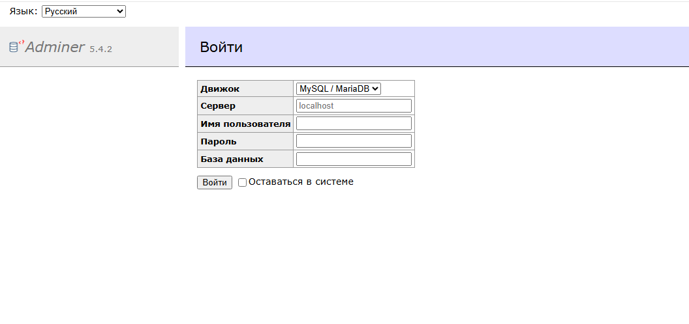

## Adminer (альтернатива phpMyAdmin)
Запустите **Adminer** в **Windows Powershell**
```shell
docker run -d
  --name adminer
  -p 8084:8080
  adminer:latest
```
[Откройте: http://localhost:8084](http://localhost:8084)

