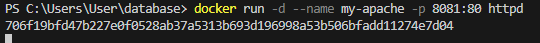
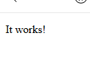
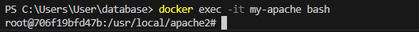
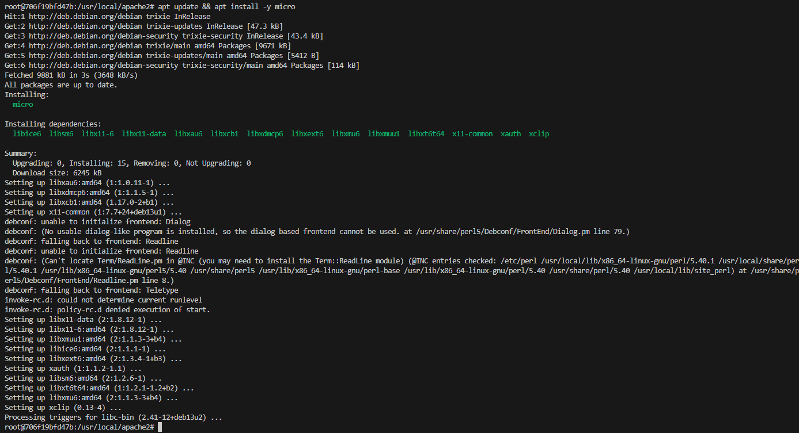
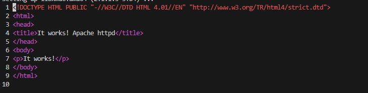
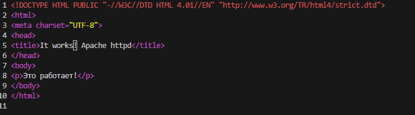
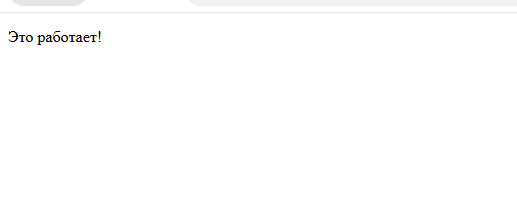

# Apache

## Скриншоты задания:

Получить образ, создать и запустить контейнер:
```shell
docker run -d --name my-apache -p 8081:80 httpd
```
[Откройте адрес http://localhost:8081 в браузере](http://localhost:8081)

1. 

2. 

### Редактирование веб-страницы

Зайти в контейнер
```shell
docker exec -it my-apache bash
```

3. 

Установить текстовый редактор командной строки Micro:
```shell
apt update && apt install -y micro
```

4. 

Открыть файл `index.html` для редактирования содержимого
```shell
micro /usr/local/apache2/htdocs/index.html
```

5. 

> Чтобы в веб-странице поддерживался русский язык, вставьте тэг `<meta charset="UTF-8">`

отредайтируйте и сохраните по `Ctrl+S` и выйти из режима редактирования по `Ctrl+Q` или `F10`

[Проверьте результат по адрес http://localhost:8081](http://localhost:8081)

6. 

7. 

Выйти из контейнера:
```shell
exit
```