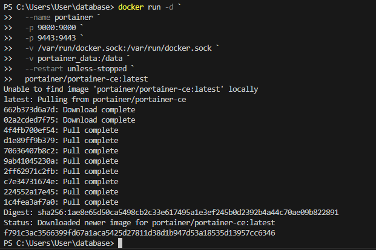
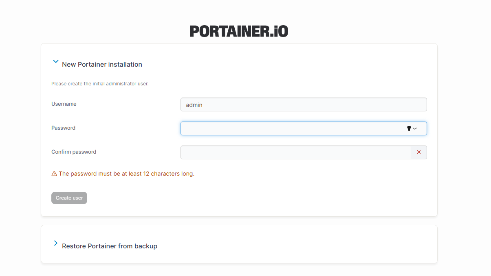
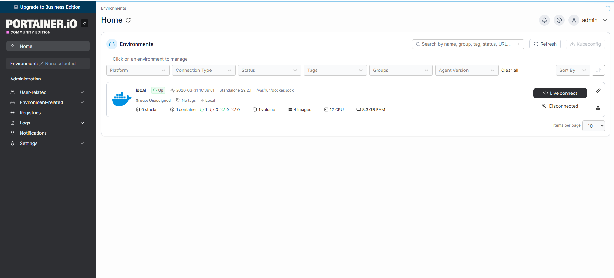
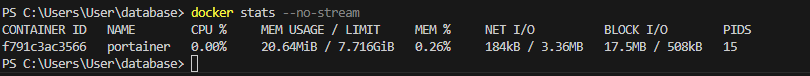
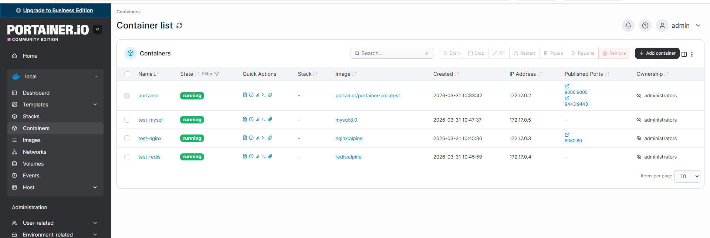
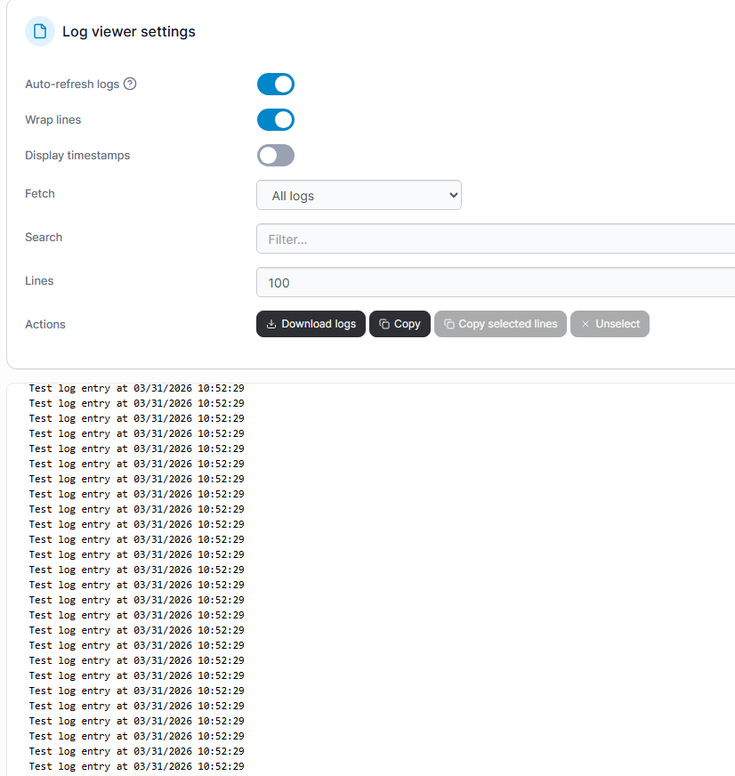
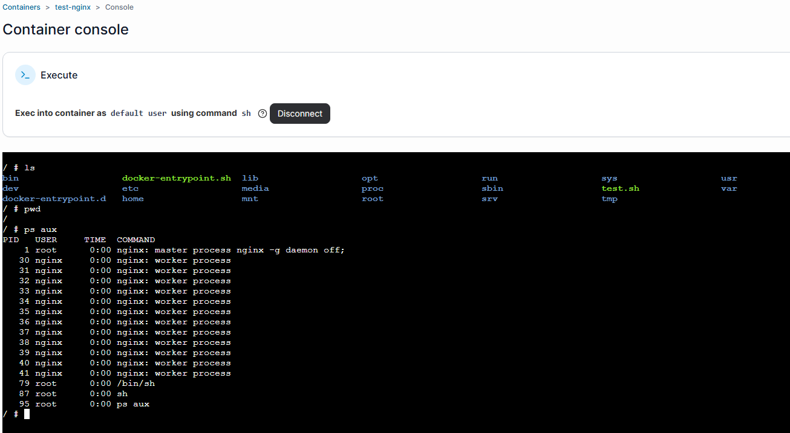
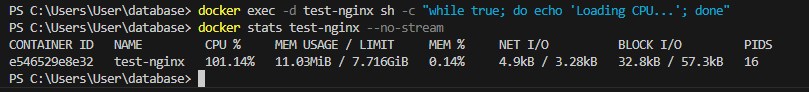

# Portainer
## Скриншоты задания:
### Вариант с томами (с сохранением данных)

в **Windows Powershell**
```shell
docker run -d `
  --name portainer `
  -p 9000:9000 `
  -p 9443:9443 `
  -v /var/run/docker.sock:/var/run/docker.sock `
  -v portainer_data:/data `
  --restart unless-stopped `
  portainer/portainer-ce:latest
```

> Если эта команда в Powershell не работает, то удалите из кода апострофы `

в **Git-Bash/Linux/WSL 2.0/Mac**
```shell
docker run -d \
  --name portainer \
  -p 9000:9000 \
  -p 9443:9443 \
  -v /var/run/docker.sock:/var/run/docker.sock \
  -v portainer_data:/data \
  --restart unless-stopped \
  portainer/portainer-ce:latest
```

1. 

2. 

3. 

## Исследование Dashboard

Получение статистики через Docker CLI для сравнения
```shell
docker stats --no-stream
```

4. 

## Управление контейнерами

Запуск тестовых контейнеров для демонстрации
```shell
docker run -d --name test-nginx -p 8080:80 nginx:alpine
docker run -d --name test-redis redis:alpine
docker run -d --name test-mysql -e MYSQL_ROOT_PASSWORD=root mysql:8.0
```

5. 

Генерация логов в тестовом контейнере
```shell
docker run -d --name test-logger alpine sh -c "while true; do echo 'Test log entry at $(date)'; sleep 2; done"
```

6. 

Подготовка контейнера для терминала
```shell
docker exec -it test-nginx sh -c "echo '#!/bin/sh' > /test.sh && echo 'echo Hello from container' >> /test.sh && chmod +x /test.sh"
```

7. 

Создание нагрузки для демонстрации статистики
```shell
docker exec -d test-nginx sh -c "while true; do echo 'Loading CPU...'; done" &
```
Просмотр статистики через CLI
```shell
docker stats test-nginx --no-stream
```

8. 
