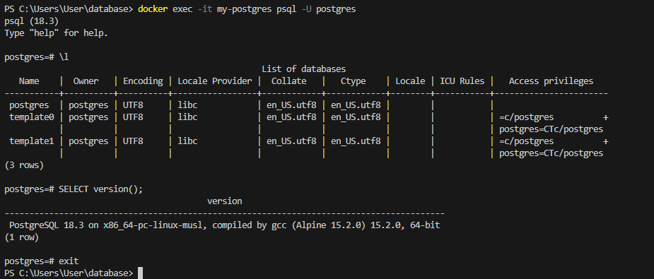

## PostgreSQL

Запуск **PostgreSQL** с паролем

в **Windows Powershell**
```shell
docker run -d `
  --name my-postgres `
  -p 5432:5432 `
  -e POSTGRES_PASSWORD=mysecretpassword `
  postgres:alpine
```
Подключиться через `psql`
```shell
docker exec -it my-postgres psql -U postgres
```
- Выполнить несколько демонстрационных команд, например:

Получить список баз данных:
```sql
\l
```
Получить версию:
```sql
SELECT version();
```
выйти из БД
```sql
exit
```
