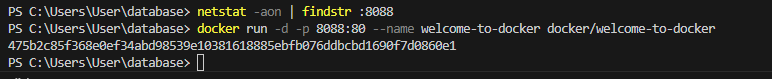
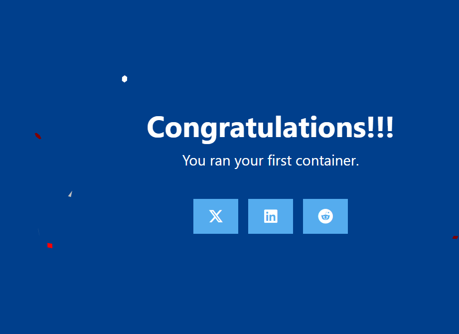
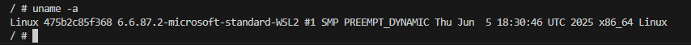
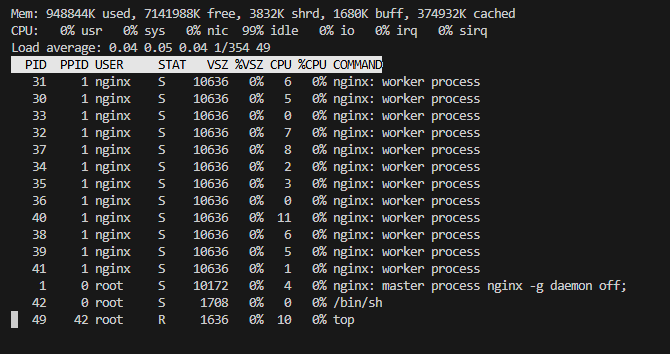
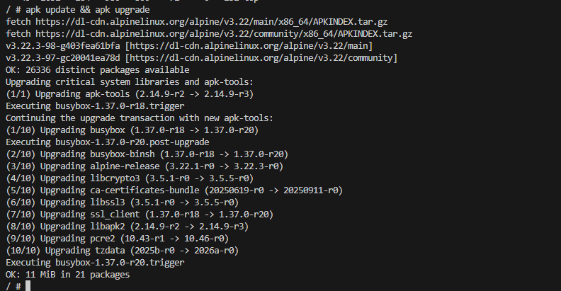
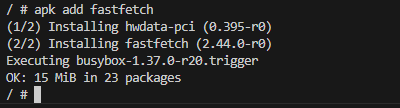
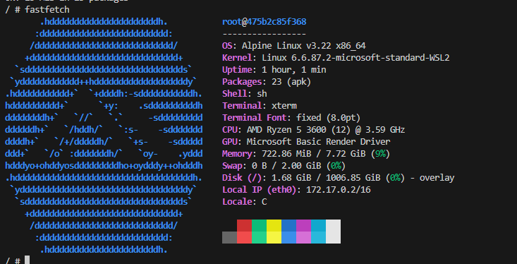

# Welcome to Docker
## Скриншоты задания:
Проверить порт `8088` для **Linux/Mac/WSL**:
```shell
# Проверьте, занят ли порт
netstat -tuln | grep :8088
```
Загрузить образ и запустить контейнера
```shell
docker run -d -p 8088:80 --name welcome-to-docker docker/welcome-to-docker
```
[Открыть http://localhost:8088 в браузере](http://localhost:8088)

1. 

2. 

Зайти в контейнер
```shell
docker exec -it welcome-to-docker /bin/sh
```
Повыполнять разные команды:

Показать ин-фу по ОС
```shell
uname -a
```

3. 

Диспетчер ресурсов
```shell
top
```

4. 

Обновить источники приложений
```shell
apk update && apk upgrade
```

5. 

Установить приложение
```shell
apk add fastfetch
```

6. 

Запустить приложение
```shell
fastfetch
```

7. 
