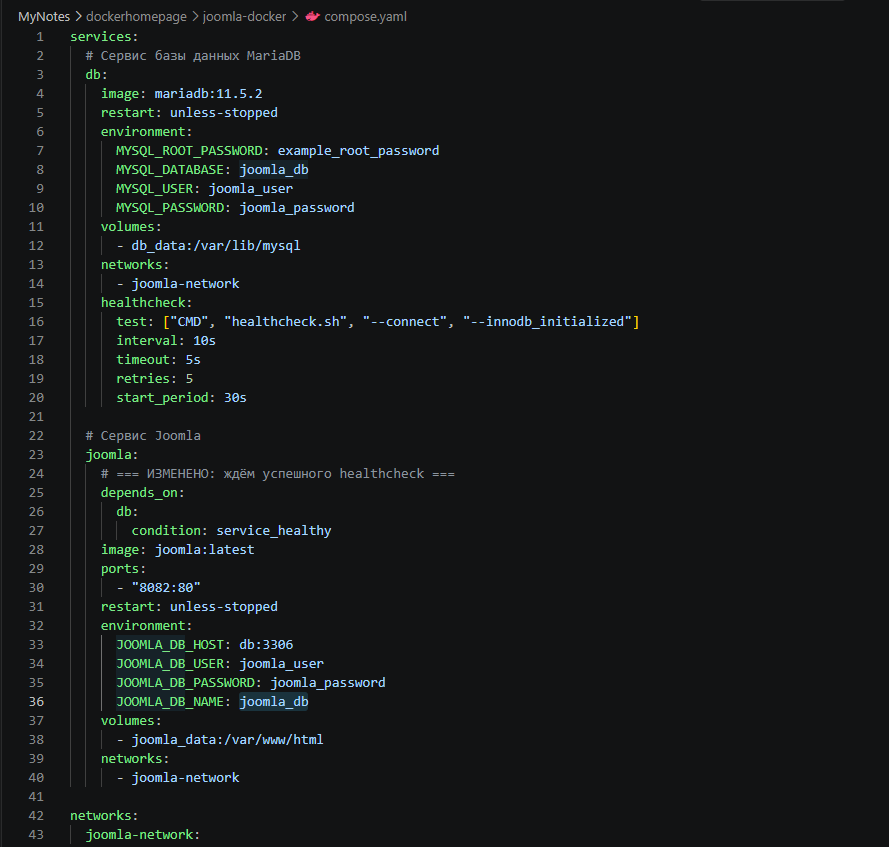
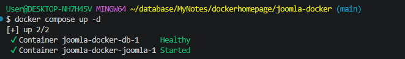
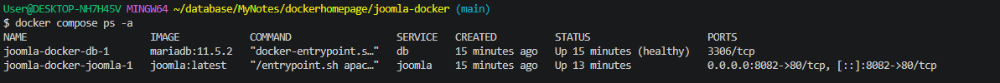
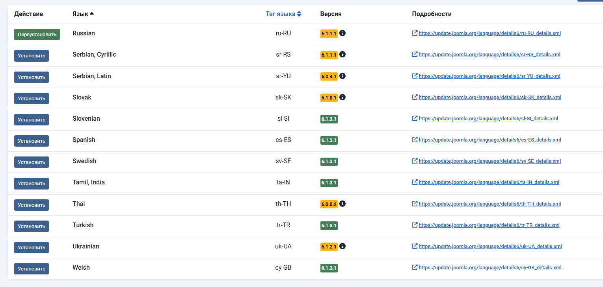
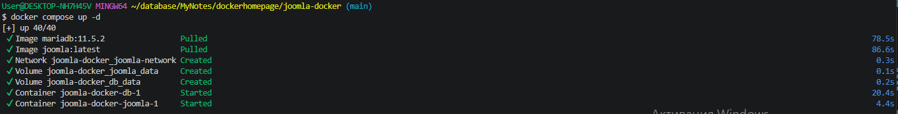
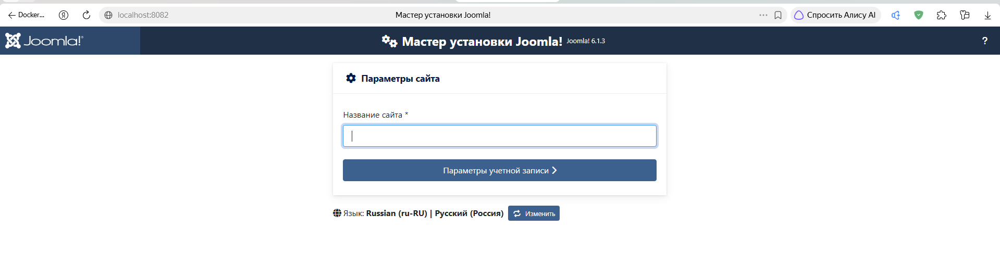
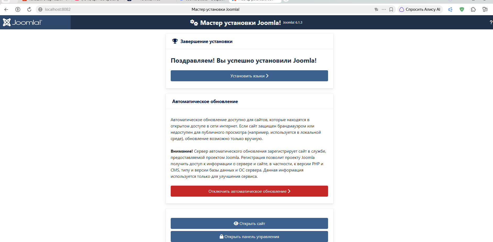
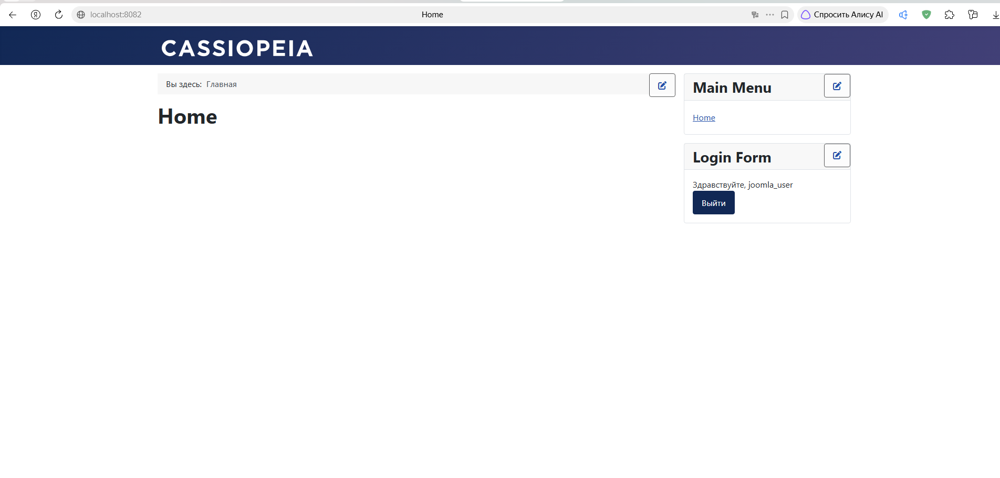
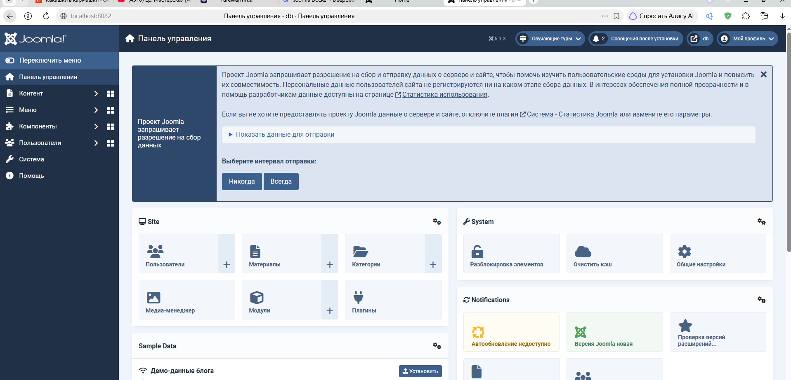

# Docker Compose проект с Joomla

**Joomla!** (произносится «джу́мла») — бесплатная система управления контентом (CMS) с открытым исходным кодом, написанная на **PHP** и **JavaScript**. Использует в качестве хранилища базы данных **MySQL** или другие реляционные СУБД.

> ℹ️ Админка и фронтэнд работают, но подробно протестировать пока не успел.

---

## 📋 Содержание

- [0. Подготовка](#0-подготовка)
- [1. Создание каталога проекта](#1-создание-каталога-проекта)
- [2. Файл конфигурации `compose.yaml`](#2-файл-конфигурации-composeyaml)
- [3. Установка и запуск проекта](#3-установка-и-запуск-проекта)
- [4. Процесс установки Joomla](#4-процесс-установки-joomla)
- [5. Управление и полезные команды](#5-управление-и-полезные-команды)
- [6. Удаление проекта](#6-удаление-проекта)

---

## 0. Подготовка

Перед началом работы над этим проектом проверьте другие запущенные у вас **docker-compose** приложения:

```shell
docker compose ls
```

Их лучше остановить, чтобы снизить риск возникновения конфликтов использования портов.

---

## 1. Создание каталога проекта

Структура проекта:

```
joomla-docker/
└── compose.yaml
```

Создаём каталог проекта:

```shell
mkdir -p joomla-docker && touch joomla-docker/compose.yaml && cd joomla-docker
```

---

## 2. Файл конфигурации `compose.yaml`

> Для совместимости со старыми версиями Docker Compose файл можно назвать `docker-compose.yml`.

Создаём и редактируем файл настроек композера средствами **VS Code** или через **Git-Bash**.

```yml
services:
  # Сервис базы данных MariaDB
  db:
    # Используем официальный образ MariaDB 11.5.2
    image: mariadb:11.5.2
    # Контейнер автоматически перезапускается, если он остановился или упал
    restart: unless-stopped
    environment:
      # Обязательные переменные окружения для базы данных
      MYSQL_ROOT_PASSWORD: example_root_password
      MYSQL_DATABASE: joomla_db
      MYSQL_USER: joomla_user
      MYSQL_PASSWORD: joomla_password
    volumes:
      # Сохраняем данные базы данных в Docker-томе для персистентности
      - db_data:/var/lib/mysql
    networks:
      - joomla-network

  # Сервис Joomla
  joomla:
    # Зависит от сервиса db, запустится только после того, как база данных будет готова
    depends_on:
      - db
    # Используем официальный образ Joomla с Apache
    image: joomla:latest
    # Пробрасываем порт 8082 на хосте на порт 80 в контейнере
    ports:
      - "8082:80"
    restart: unless-stopped
    environment:
      # Переменные окружения для подключения Joomla к базе данных
      JOOMLA_DB_HOST: db:3306
      JOOMLA_DB_USER: joomla_user
      JOOMLA_DB_PASSWORD: joomla_password
      JOOMLA_DB_NAME: joomla_db
    volumes:
      # Монтируем директорию с данными Joomla для сохранения контента, плагинов и тем
      - joomla_data:/var/www/html
    networks:
      - joomla-network

# Определяем общую сеть для связи контейнеров
networks:
  joomla-network:

# Определяем Docker-тома для хранения данных
volumes:
  db_data:
  joomla_data:
```



---

## 3. Установка и запуск проекта

Находясь в каталоге проекта `joomla-docker`, выполните:

Запуск всех сервисов:

```shell
docker compose up -d
```



Проверка статуса:

```shell
docker compose ps -a
```



Просмотр логов **Joomla**:

```shell
docker compose logs -f joomla
```

Проверьте логи **MySQL**:

```shell
docker compose logs db
```

Проверьте сеть (опционально):

```shell
docker network inspect joomla-docker_joomla-network
```

---

## 4. Процесс установки Joomla

Выполнить установку **Joomla** через веб-установщик:

👉 [Откройте веб-установщик Joomla: http://localhost:8082](http://localhost:8082)

Вы перейдёте на стандартную страницу мастера установки **Joomla**. Вас попросят выполнить несколько шагов:

- **Выбор языка установщика** (например, `Русский` или `English`).



- **Проверка предустановки**: установщик проверит, что серверное окружение соответствует требованиям **Joomla**. Всё должно быть зелёным.


- **Настройка базы данных**:
  - Тип базы данных: `MySQLi` или `PDO MySQL` (подойдёт любой).
  - Имя сервера баз данных: `db` (это имя сервиса из нашего `compose.yaml`).
  - Имя пользователя: `joomla_user`
  - Пароль: `joomla_password`
  - Имя базы данных: `joomla_db`

  Префикс таблиц: можно оставить по умолчанию или изменить для безопасности.

- **Настройка веб-сайта**:
  - Название сайта: придумайте любое название.
  - Ваш E-mail: укажите свой email.
  - Имя администратора: придумайте имя пользователя для входа в админ-панель.
  - Пароль администратора: надёжный пароль.



- **Установка**: после ввода всех данных нажмите **«Установить»**. Joomla создаст все необходимые таблицы в базе данных и завершит настройку.



После завершения вы увидите окно с вашими данными администратора. Для продолжения работы удалите папку `installation`, следуя важному примечанию на экране установщика.

Теперь ваш сайт доступен по адресам:

- 🌐 Joomla сайт: [http://localhost:8082](http://localhost:8082)
- 🔐 Админ-панель: [http://localhost:8082/administrator](http://localhost:8082/administrator)





---

## 5. Управление и полезные команды

Находясь в папке `joomla-docker`:

### 1. Просмотр логов приложения Joomla в реальном времени

```shell
docker compose logs -f joomla
```

`-f` — в режиме ожидания (в режиме реального времени).

Чтобы выйти из режима просмотра логов, нажмите `Ctrl+C` в терминале.

### 2. Просмотр логов базы данных db в реальном времени

```shell
docker compose logs -f db
```

Чтобы выйти из режима просмотра логов, нажмите `Ctrl+C` в терминале.

### 3. Приостановить запущенный контейнер

```shell
docker compose stop
```

### 4. Запустить приостановленный контейнер

```shell
docker compose start
```

### 5. Перезапустить

```shell
docker compose restart
```

### 6. Показать конфигурацию текущего проекта

```shell
docker compose config
```

---

## 6. Удаление проекта

Переходим в папку проекта:

```shell
cd joomla-docker
```

Останавливаем и удаляем контейнеры и **volumes**:

```shell
docker compose down --volumes
```

или коротко:

```shell
docker compose down -v
```

Выходим из каталога проекта:

```shell
cd ..
```

Удаляем папку проекта через `sudo`, если в **Linux**. Для **Windows** — без `sudo`:

```shell
rm -rf joomla-docker
```

---
